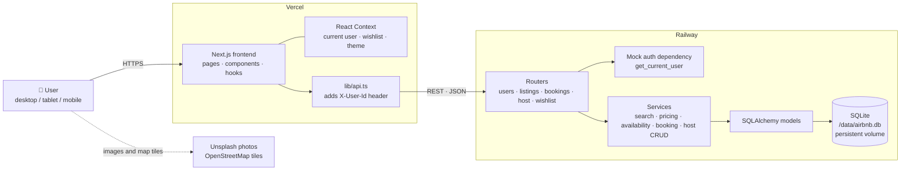
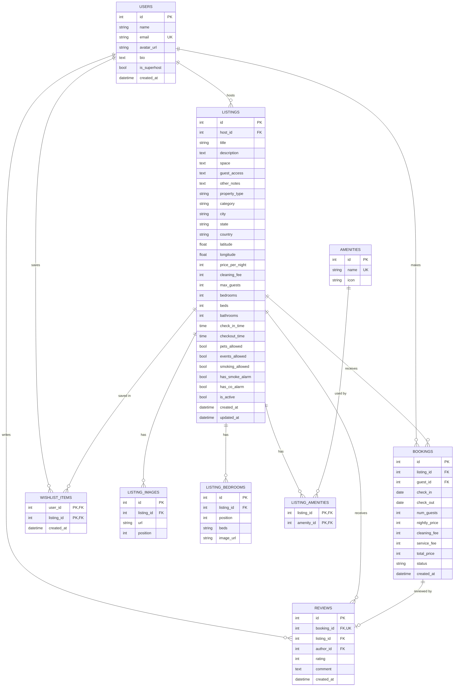

<div align="center">

# Airbnb Clone

**A full-stack stay booking platform: browse, search, book and host.**

Built for the Scaler SDE Fullstack assignment with Next.js, FastAPI and SQLite.


| | Link |
| :-- | :-- |
| **Live app** | https://airbnb-clone-seven-pi-11.vercel.app |
| **API docs (Swagger)** | https://YOUR-BACKEND.up.railway.app/docs |
| **Repository** | https://github.com/aaban-khan-dev/Airbnb-Clone |

</div>


---

## Table of Contents

| # | Section | What's inside |
| :-: | :-- | :-- |
| 1 | [Features](#features) | Everything guests and hosts can do |
| 2 | [Getting Started](#getting-started) | Run the backend and frontend locally |
| 3 | [Tech Stack](#tech-stack) | Libraries and why they were chosen |
| 4 | [Architecture](#architecture) | HLD diagram, folder structure, design decisions |
| 5 | [Preventing Double Bookings](#preventing-double-bookings) | API check + database trigger |
| 6 | [Database Schema](#database-schema) | ER diagram, design decisions, seed data |
| 7 | [API Overview](#api-overview) | Endpoints and status codes |
| 8 | [Deployment](#deployment) | Vercel + Railway setup |
| 9 | [Assumptions](#assumptions) | Scope decisions and mocked parts |
| 10 | [Challenges and Future Work](#challenges-and-future-work) | What was hard, what's missing, what's next |

---

## Features

| Area | Highlights |
| :-- | :-- |
| **Home & search** | Photo-card grid with carousels · search by location, dates and guests · category menu · filters for price, property type and amenities with a live count · infinite scroll · list and map views |
| **Listing page** | Photo gallery · "About this space" with Show more · Where you'll sleep · amenities · availability calendar · price breakdown · reviews · area map · host card · house rules, safety and cancellation policy |
| **Booking** | Guest and date validation · checkout summary with mocked payment · confirmation page · upcoming, past and cancelled trips · cancellation · double-booking protection in the API **and** the database |
| **Host tools** | Dashboard with stats · create, edit and delete listings (photos, amenities, bedrooms, house rules) · reservations across all owned listings |
| **Experience** | Wishlists · toasts for every action · modals · mobile tab bar and bottom reserve bar |
| **Bonus** | Interactive map with price pins · reviews after completed stays · Superhost and Guest favourite badges · aggregated ratings · light, dark and system themes · mobile, tablet and desktop layouts |
| **Mocked** | Switch between demo users instead of logging in · simulated checkout · messaging, language and currency marked "Coming soon" |

---

## Getting Started

**Prerequisites:** Python 3.11+ · Node.js 20.9+ with npm · Git

### 1. Clone

```bash
git clone https://github.com/aaban-khan-dev/Airbnb-Clone.git
cd Airbnb-Clone
```

### 2. Backend: FastAPI on port 8000

```bash
cd backend
python -m venv .venv
.venv\Scripts\Activate.ps1        # Windows PowerShell
source .venv/bin/activate         # macOS / Linux
pip install -r requirements.txt
uvicorn app.main:app --reload
```

On first start the backend creates `airbnb.db` and fills it with demo data. API docs: http://localhost:8000/docs

Optional `backend/.env` (see `.env.example`):

| Variable | Default | Purpose |
| :-- | :-- | :-- |
| `DATABASE_URL` | `sqlite:///./airbnb.db` | Location of the SQLite file |
| `ALLOWED_ORIGINS` | `http://localhost:3000` | Comma-separated frontend URLs allowed by CORS |

### 3. Frontend: Next.js on port 3000

```bash
cd frontend
npm install
```

Create `frontend/.env.local`:

```env
NEXT_PUBLIC_API_URL=http://localhost:8000
```

```bash
npm run dev
```

Open http://localhost:3000.

### Useful commands

| Command | Folder | Purpose |
| :-- | :-- | :-- |
| Delete `airbnb.db`, restart backend | `backend/` | Re-seed a fresh database (needed after model changes; there are no migrations) |
| `python -m scripts.check_images` | `backend/` | Check that every sample photo URL loads |
| `npm run lint` · `npx tsc --noEmit` · `npm run build` | `frontend/` | Lint, type-check and production build |

### Try the demo

There's no login. A default user is signed in, and **profile menu → Switch user** changes users (each one is labelled Host or Guest).

- **As a guest:** search "Goa", pick dates, open a listing, reserve, then find the trip under **Trips**.
- **As a host:** switch to **Kabir Singh**, then click **Switch to hosting** to see his listings, stats and reservations.

---

## Tech Stack

| Layer | Technology | Why |
| :-- | :-- | :-- |
| Frontend | Next.js 16 (App Router), React 19, TypeScript | File-based routing that maps onto Airbnb's pages, typed components |
| Styling | Tailwind CSS v4 | Design tokens in one place, class-based dark mode |
| Maps | Leaflet, React Leaflet, OpenStreetMap | Interactive maps, no paid API key |
| UI helpers | lucide-react, sonner, date-fns | Icons, toasts, date handling |
| Backend | FastAPI | Request validation and auto-generated Swagger docs |
| ORM | SQLAlchemy 2.0 | Typed models, relationships, eager loading, constraints |
| Validation | Pydantic v2, pydantic-settings | Request/response schemas, config from env vars |
| Database | SQLite | Foreign keys enforced, plus a trigger that blocks overlapping bookings |
| Hosting | Vercel (frontend), Railway (backend + persistent volume) | Free tiers, SQLite file survives redeploys |

---

## Architecture

### High-level design



The browser talks only to the Next.js app and the FastAPI REST API. Photos and map tiles load straight from their public CDNs. Every request goes **router → service → model → database**, and protected routes resolve the current user through a single auth dependency.

### Folder structure

<table>
<tr><th>Backend: <code>backend/app</code></th><th>Frontend: <code>frontend/src</code></th></tr>
<tr><td>

```text
main.py     app setup, CORS, startup seed
core/       settings, mock auth, constants
db/         engine, session, seed data
models/     SQLAlchemy tables
schemas/    Pydantic request/response models
services/   business logic by domain
routers/    endpoints by resource
```

</td><td>

```text
app/          pages and routes
components/   UI grouped by feature
context/      user, wishlist, theme
hooks/        search, quote, scroll, click-outside
lib/          API client, types, helpers
```

</td></tr>
</table>

### Key design decisions

- **Layered backend:** routers never touch SQL. They call services, which return Pydantic schemas.
- **One auth hook:** `get_current_user` reads `X-User-Id` (401 if missing or unknown). Real auth (JWT or sessions) would replace only this function.
- **Ownership checks:** hosts can only see and edit their own listings, and guests can only see and cancel their own trips.
- **Pricing in one place:** `services/pricing.py` is shared by quotes, bookings and the seed. The service fee is 14% of the nightly subtotal.
- **No N+1 queries:** photos load with `selectinload`, and dashboard stats use grouped queries.
- **URL holds the search state:** filters, dates and guests survive refresh, Back and shared links.
- **Shared API client:** `lib/api.ts` adds the user header and turns FastAPI errors (including 422s) into readable messages.
- **Responsive by breakpoints:** phones get a search sheet, tab bar, photo slider and reserve bar; desktop gets the shrinking search header and a sticky booking card.
- **Dark mode without a flash:** a tiny script sets the theme before the page paints.

---

## Preventing Double Bookings

An availability check alone has a race condition: two requests can both pass it before either one saves. So the app uses two layers:

1. **Service check:** `booking_service` rejects overlapping confirmed bookings with **409 Conflict**.
2. **Database trigger:** a SQLite `BEFORE INSERT/UPDATE` trigger repeats the check inside the write, so the second booking always fails.

With the service check turned off, 10 simultaneous requests for the same dates produced **1 booking and 9 rejections**.

Date ranges are **half-open** (check-in included, checkout excluded), so one guest can check out on the day the next one checks in.

---

## Database Schema

**9 tables.** Money is stored as whole rupees (integers) to avoid floating-point errors.



### Design decisions

| Decision | Why |
| :-- | :-- |
| One `users` table for guests and hosts | The same person can do both; a user is a host because they own listings |
| Price snapshot on `bookings` | Guests keep the price they booked at, even if the host changes it later |
| Soft delete (`listings.is_active`) | Deleting hides the listing and cancels upcoming stays, but keeps past trips, reviews and earnings |
| Ratings computed with `AVG()` | No stored number that can drift out of sync with the reviews |
| `reviews.booking_id` is UNIQUE | One review per stay, only from someone who stayed |
| Composite primary keys on `listing_amenities`, `wishlist_items` | The database itself blocks duplicate links |
| CHECK constraints | Positive prices and guest counts, `check_out > check_in`, rating 1–5, valid status |
| Overlap trigger + index on `(listing_id, check_in, check_out)` | Double bookings are impossible; availability checks stay fast |
| `PRAGMA foreign_keys=ON` on every connection | SQLite ignores foreign keys unless this is switched on |
| `ON DELETE CASCADE` for images, bedrooms, amenity links, wishlist items | These rows mean nothing without their parent |
| Images and bedrooms in their own tables, with `position` | Ordered galleries (position 0 is the cover) and any number of bedrooms |

### Seed data

Seeded automatically when the database is empty. A fixed random seed makes it reproducible, and dates are relative to today, so there are always past stays with reviews and upcoming stays that block the calendar.

| Users | Listings | Images | Bedrooms | Bookings | Reviews | Wishlist items |
| :-: | :-: | :-: | :-: | :-: | :-: | :-: |
| 12 (6 hosts, 6 guests) | 32 in 28 cities | 195 (unique covers) | 67 | 212 (66 upcoming) | 122 | 21 |

Prices range from ₹2,600 to ₹18,500 a night across 7 property types and 8 categories.

---

## API Overview

Base URL `http://localhost:8000` · full interactive docs at `/docs` · 🔒 = needs the `X-User-Id` header

| Method | Endpoint | Description |
| :-- | :-- | :-- |
| `GET` | `/api/health` | Health check (also pings the database) |
| `GET` | `/api/users` | Users for the "Switch user" menu |
| `GET` | `/api/users/me` 🔒 | Current user |
| `GET` | `/api/listings` | Search by location, dates, guests, category, type, amenities, price; paginated |
| `GET` | `/api/listings/filters` | Options for the filter UI |
| `GET` | `/api/listings/{id}` | Full listing: photos, bedrooms, amenities, host, reviews, rules, booked dates |
| `GET` | `/api/listings/{id}/quote` | Price breakdown and availability for given dates |
| `POST` | `/api/bookings` 🔒 | Book a stay → `201`, or `409` if the dates were just taken |
| `GET` | `/api/bookings/me` 🔒 | My trips |
| `GET` | `/api/bookings/{id}` 🔒 | One of my bookings |
| `POST` | `/api/bookings/{id}/cancel` 🔒 | Cancel an upcoming trip |
| `POST` | `/api/bookings/{id}/review` 🔒 | Review a completed stay → `201` |
| `GET` | `/api/host/listings` 🔒 | My listings with rating, upcoming bookings, earnings |
| `POST` | `/api/host/listings` 🔒 | Create a listing → `201` |
| `GET` | `/api/host/listings/{id}` 🔒 | Current values for the edit form |
| `PUT` | `/api/host/listings/{id}` 🔒 | Update a listing |
| `DELETE` | `/api/host/listings/{id}` 🔒 | Soft-delete a listing (cancels upcoming bookings) |
| `GET` | `/api/host/bookings` 🔒 | Reservations on my listings (`listing_id`, `when` filters) |
| `GET` | `/api/wishlist` 🔒 | My saved listings |
| `GET` | `/api/wishlist/ids` 🔒 | Saved listing IDs (to fill the hearts) |
| `PUT` | `/api/wishlist/{listing_id}` 🔒 | Save a listing → `204` (idempotent) |
| `DELETE` | `/api/wishlist/{listing_id}` 🔒 | Remove a listing → `204` (idempotent) |

**Status codes:** `200` OK · `201` created · `204` no content · `400` rule broken (e.g. cancelling a started trip) · `401` missing/unknown user · `403` not allowed · `404` not found or not yours · `409` dates taken · `422` invalid input · `503` database busy, retry

---

## Deployment

| Part | Platform | Settings |
| :-- | :-- | :-- |
| Backend | Railway | Root directory `backend` · start command `uvicorn app.main:app --host 0.0.0.0 --port $PORT` · volume mounted at `/data` · `DATABASE_URL=sqlite:////data/airbnb.db` · `ALLOWED_ORIGINS=<vercel-url>` |
| Frontend | Vercel | Root directory `frontend` · `NEXT_PUBLIC_API_URL=<railway-url>` |

The volume keeps the SQLite file across redeploys. If it is ever empty, the app re-seeds the demo data on startup.

---

## Assumptions

- **Auth is mocked:** a default user is signed in, and you can switch between seeded users. A user counts as a host once they own a listing.
- **Payment is mocked:** the checkout form only validates the format. Card details are never stored or sent anywhere.
- **Placeholders:** messaging, language and currency are marked "Coming soon".
- **Photos by URL:** the brief allows "URL/upload", and cloud upload is not built.
- **Demo data:** listing photos are free stock photos from [Unsplash](https://unsplash.com) (Unsplash License), and avatars are generic placeholders from pravatar.cc. All names, listings, bookings and reviews are fictional. No real personal data is used.
- **Money:** whole Indian rupees. The host sets the cleaning fee, and the service fee is 14% of the nightly subtotal. No taxes.
- **Cancellation:** free until the day before check-in. A trip that has started can't be cancelled.
- **Bookings** are confirmed instantly (no host approval), and hosts can't book their own listings.
- **Reviews:** only after a completed stay, one per booking.
- **Dates** are calendar dates without time zones. Check-in and checkout times are shown as house rules.
- **Maps** show an approximate area, not the exact address.
- **No migrations:** after model changes, delete `airbnb.db` and restart.

---

## Challenges and Future Work

### Challenges

- **Concurrent bookings:** an app-level check isn't enough on its own, so a database trigger was added and tested with simultaneous requests.
- **UI fidelity:** the search bar that morphs on scroll, the two-month date picker with booked nights and same-day turnovers, and separate mobile layouts.
- **Shareable search state:** filters, dates and pagination live in the URL and survive refresh and Back.
- **Dark mode:** no flash of the light theme on load, and the map tiles match the theme.
- **SQLite in production:** it needs a persistent disk, so Railway runs with a mounted volume.

### Known limitations

- No real authentication: anyone can act as any demo user.
- Photos must be existing URLs; broken links fall back to a placeholder.
- No real payments, refunds, messaging or host approval flow.
- No migrations (e.g. Alembic) and no automated test suite. Testing was manual against a checklist, plus ad-hoc API scripts.
- SQLite allows one writer at a time, which is fine for a demo but not for heavy traffic.
- Free hosting may sleep when idle, so the first request after a while can be slow.

### Future additions

- Real sign-up and login (JWT or OAuth) with role checks on every route.
- Photo upload to cloud storage (Cloudinary or S3) with drag-and-drop ordering.
- Guest ↔ host messaging, and booking requests that hosts approve or decline.
- A payment gateway in test mode (Razorpay or Stripe) with refunds.
- Weekend and seasonal pricing, weekly discounts, minimum stays.
- "Search as I move the map" and landmark search.
- PostgreSQL with Alembic, plus pytest and Playwright tests.
